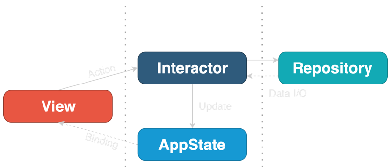

참고 및 자료 출처 : 
- [(레퍼런스 프로젝트) Github - nalexn](https://github.com/nalexn/clean-architecture-swiftui)
- [(번역) SwiftUI를 위한 클린 아키텍쳐](https://gon125.github.io/posts/SwiftUI%EB%A5%BC-%EC%9C%84%ED%95%9C-%ED%81%B4%EB%A6%B0-%EC%95%84%ED%82%A4%ED%85%8D%EC%B2%98/)

---

# SwiftUI에 어울리지 않는 아키텍쳐들

## VIPER, RIBs, VIP

1. SwiftUI는 `Router` 개념이 굳이 필요없다.
2. SwiftUI의 데이터 흐름 설계는 **View-State Binding**의 네이티브 지원과 합쳐져서, `Presenter`가 필요할 이유가 없을 정도로 **Setup 코드를 축소**시켰다.
3. 아키텍쳐상의 모듈의 수가 줄어들었기 때문에, `Builder` 역시 필요 없다는 것을 알 수 있다.

따라서, 각 아키텍쳐들이 해결하려고 했던 문제들이 **SwiftUI에는 존재조차 하지 않기 때문**에, 기존의 아키텍쳐들은 어울리지 않는것.

## 그러면 MVVM은?

**(지극히 주관적인 경험담)**

> `MVVM` 패턴은 경험상, 프로젝트의 크기가 조금만 커져도 **쉽게 겪을 수 있는 문제들**이 있음.

1. 점점 `ViewModel`의 역할이 **단일 View를 위한 Business Logic들을 한 파일에 모아놓는 역할**만을 하게 되는 현상을 겪을 수 있음.
2. `View`와 `ViewModel`을 1:1로 설계하다 보면, `ViewModel`간 데이터를 공유하는 방법이 복잡해짐.
	1. SwiftUI의 `Navigation` 시스템은 불완전하고, 불편하다.
		1. 따라서, 데이터 흐름을 제어하기 위해 `ViewModel`에 의존하기도 애매하고, 다른 뾰족한 방법도 없다는 문제가 있음.
3. 아키텍쳐 수준에서, **전역 상태값을 관리**하기 위한 명확한 방법이 존재하지 않음.
	1. **SingleTon** 클래스의 의존도와 역할이 비대해짐.

여전히 `MVVM` 패턴은 Mobile 개발 업계에서는 표준처럼 여겨지는 훌륭한 아키텍쳐이지만, SwiftUI와는 잘 어울리지 않는다고 생각함.


# Clean Architecture

>소프트웨어를 레이어별로 나누고, Dependency Rule을 준수함으로써 본질적인 테스트가 가능한 시스템을 만들 수 있습니다. 이에 따른 이점들은 덤이죠.



## AppState

- Clean Architecture에서 유일하게 `Object`인 `Entity` 이다. (`ObservableObject` 등)
- `Redux` 처럼, **AppState**는 **SSOT(Single Source of Truth)**로서, 앱의 **전역 State**를 유지한다.
	- **SSOT** : 정보와 스키마를 오직 하나의 출처에서만 생성, 편집하도록 하는 방법론이다. 단일 출처를 통해 데이터를 생성, 편집, 접근하므로 데이터의 정합성을 지키고 잘못된 데이터 유통을 방지하고 모두가 동일한 데이터를 참고하게 하고 있다.
- 유저의 데이터, 인증 토큰, Screen Navigation 상태(현재 보이는 View, 선택된 탭 등), 시스템 상태(활성, 백그라운드 상태 등)와 같은 **State** 들이 이에 해당.
- **AppState**는 <u>**다른 레이어에 대해 일체 아는것이 없고, 어떠한 비즈니스 로직도 포함하고 있지 않는다.**</u>

##### \[예시 코드\]

```swift
class AppState: ObservableObject, Equatable {
    @Published var userData = UserData()
    @Published var routing = ViewRouting()
    @Published var system = System()
}
```


## View

- 지역 `@State`를 가질 수 있다.
- 다른 모든 Layer 들은 **View** 레이어의 존재를 알지 못한다.
	- `Protocol` 뒤에 숨길 필요가 없음.
- 인스턴스화 될 때, **AppState**와 **Interactor**를 받는다.
	- `@EnvironmentObject`, `@ObservableObject` 등, SwiftUI 표준 종속성 주입(DI)을 통해서 받는다.
- **Side Effects**는 **사용자의 Interaction** 또는 **View의 `onAppear`(Life Cycle events)**에 의해 트리거되고, 이는 **Interactor**로 전달된다.
	- 여기서 말하는 **Side Effects**는 View에 데이터를 보여주는 등 **View의 변화**를 말하는 듯 하다.

##### \[예시 코드\]

```swift
struct CountriesList: View {

    @EnvironmentObject var appState: AppState
    @Environment(\.interactors) var interactors: InteractorsContainer

    var body: some View {
        ...
        .onAppear {
            self.interactors.countriesInteractor.loadCountries()
        }
    }
}
```

## Interactor

- 특정 **View 그룹**을 위한 **Business Logic**을 캡슐화한다.
- Business Logic 레이어는 Presentation과 외부 리소스로부터 **완전히 독립적인 레이어**이다.
- **Interactor**는 <u>**상태가 없고**</u> 오로지 **AppState** Object만을 참조한다.
	- **AppStore**는 생성자 Parameter로 넘겨준다.
- **Interactor**들은 `Protocol`을 통해 `Facade`화 되어야 한다.
	- **그러면, View는 목업 Interactor와 소통하여 테스트를 하기 용이해진다.**
- **Interactor**들은 외부 소스로부터 데이터를 가져오거나 계산을 하는 등의 동작을 하지만, **직접적으로 결과를 반환하지는 않는다.** (마치 Closure처럼)
	- 대신, 결과를 **AppState** 또는 **View**로부터 전달받은 `Binding`에 전달한다.

##### \[예시 코드\]

```swift
protocol CountriesInteractor {
	func loadCountries()
	func load(countryDetails: Binding<Loadable<Country.Details>>, country: Country)
}

// MARK: - Implementation

struct RealCountriesInteractor: CountriesInteractor {
	let webRepository: CountriesWebRepository
	let appState: AppState

	init(webRepository: CountriesWebRepository, appState: AppState) {
		self.webRepository = webRepository
		self.appState = appState
	}

	func loadCountries() {
		appState.userData.countries = .isLoading(last: appState.userData.countries.value)
		weak var weakAppState = appState
		_ = webRepository.loadCountries()
			.sinkToLoadable { weakAppState?.userData.countries = $0 }
	}

	func load(countryDetails: Binding<Loadable<Country.Details>>, country: Country) {
		countryDetails.wrappedValue = .isLoading(last: countryDetails.wrappedValue.value)
		_ = webRepository.loadCountryDetails(country: country)
			.sinkToLoadable { countryDetails.wrappedValue = $0 }
	}
}
```


## Repository

- **Repository**는 데이터를 읽고 쓰는 **추상 게이트웨이**이다.
	- 웹 서버 또는 로컬 DB같은 **단일 데이터베이스**에 대한 Access를 제공한다.
	- 예를 들어, `1)자체 백엔드 서버`, `2)Google Maps API`, `3)로컬 데이터베이스`를 사용하는 경우 총 3개의 **Repository**가 존재한다.
- **Repository**는 **상태(State)가 없고,** **AppState**에 대한 **쓰기 권한이 없다.**
	- 데이터 작업과 관련된 로직만 포함하고 있기 때문.
	- 따라서, **Repository**는 **View**와 **Interactor**에 대해서는 전혀 모른다.
- 실제 **Repository**는 `Protocol` 뒤에 숨겨서 개발하는 것이 좋다.
	- 그러면 **Interactor**가 목업 **Repository**와 소통해서 테스트 코드를 작성하기 용이하게 된다.

##### \[예시 코드\]

```swift
protocol CountriesWebRepository: WebRepository {
	func loadCountries() -> AnyPublisher<[Country], Error>
	func loadCountryDetails(country: Country) -> AnyPublisher<Country.Details.Intermediate, Error>
}

// MARK - Implementation

struct RealCountriesWebRepository: CountriesWebRepository {
	let session: URLSession
	let baseURL: String
	let bgQueue = DispatchQueue(label: "bg_parse_queue")

	init(session: URLSession, baseURL: String) {
		self.session = session
		self.baseURL = baseURL
	}

	func loadCountries() -> AnyPublisher<[Country], Error> {
		return call(endpoint: API.allCountries)
	}

	func loadCoutryDetails(country: Country) -> AnyPublisher<Coutry.Details, Error> {
		return call(endpoint: API.countryDetails(country))
	}
}

// MARK: - API

extension RealCountriesWebRepository {
	enum API: APICall {
		case allCountries
		case countryDetails(Country)

		var path: String { ... }
		var httpMethod: String { ... }
		var headers: [String: String]? { ... }
	}
}
```