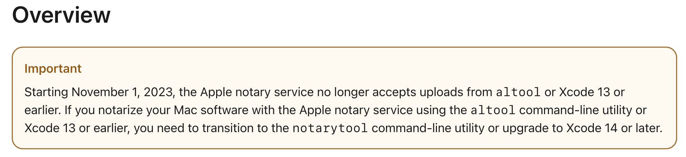

> - https://developer.apple.com/documentation/security/notarizing_macos_software_before_distribution

> **중요**
> 
> 2023년 11월 1일부터 Apple 공증 서비스는 더 이상 altool 또는 Xcode 13 이전 버전에서 업로드를 허용하지 않습니다. altool 커맨드라인 유틸리티 또는 Xcode 13 이전 버전을 사용하여 Apple 공증인 서비스를 통해 Mac 소프트웨어를 공증하는 경우, **notarytool** 커맨드라인 유틸리티로 전환하거나 Xcode 14 이상으로 업그레이드 해야 합니다.

Xcode 15 버전부터는 Archive -> Distribute 단계에서 공증을 수행할 수 있도록 기능이 추가되었다.

작성중...