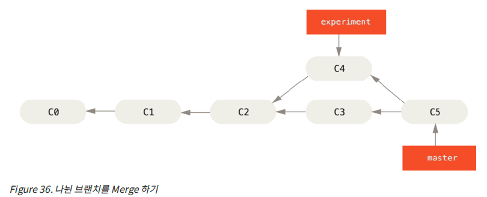
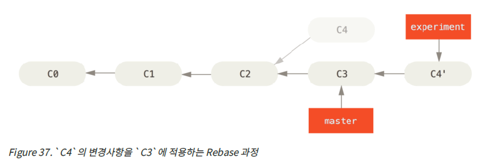
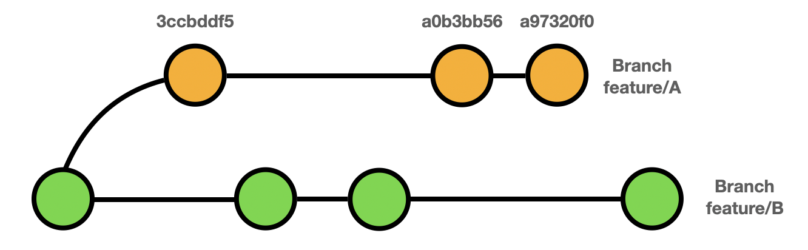
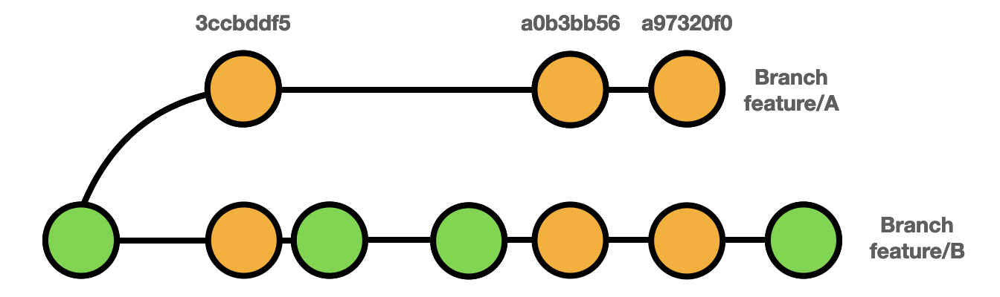

# ❓Rebase

#### **두 개의 공통 base를 가진 branch에서, 한 branch의 base를 다른 branch의 최신 commit으로 옮기는 작업. 용어 그대로, base를 다시 설정하는 명령어.**

- **다른 branch의 최신 commit** 이력을 **내가 작업중인 branch에 반영**시키고 싶을 때 유용하게 사용할 수 있다.
- "내가 작업중인 branch의 **base를 다른 branch의 head로 변경**하겠다" 라는 의미로 사용하면 된다.
- `merge` 명령어와 차이점은, 부가적인 `merge commit` 없이 commit 이력을 병합할 수 있다는 점이다.
	- 이력을 비교적 깔끔하게 관리할 수 있음.
	- (단, `merge` 명령을 `Fast-forward`로 하지 않은 경우.)

##### merge로 병합할 때 커밋 이력

##### rebase로 병합할 때 커밋 이력

---

# ❓Cherry-pick

#### **다른 branch에 있는 commit을 선택하여, 내 branch에 적용시킬 때 사용하는 명령어**

- `rebase` 명령어와의 차이점
	- 내가 작업중인 branch에, 다른 branch의 commit을 **하나씩 선택해서 병합**시킬 수 있음.
	- 이때, **선택한 commit이 내 branch에 중복**으로 남게 된다.
	- 따라서, 꼭 필요한 상황에서만 사용하는 것을 권장한다.
- **`cherry-pick`을 사용하기 좋은 상황**
	- master에 merge 되지 못한 commit 중 필요한 commit만 골라서 가져오고 싶을 때

##### cherry-pick 실행 전

##### cherry-pick 실행 후

 
 
 
 

**참고 링크 :**
- [Git Cherry-pick (티스토리 - 나만의 기록들)](https://mine-it-record.tistory.com/650)
- [Git Cherry-pick (티스토리 - A6K 개발노트)](https://hbase.tistory.com/141)
- [Git Rebase (velog - kwonh.log)](https://velog.io/@kwonh/Git-Rebase란)
- [Git Rebase (티스토리 - SH's Devlog)](https://seosh817.tistory.com/240)